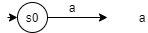
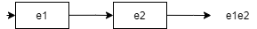
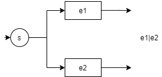
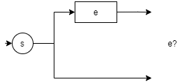
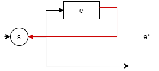
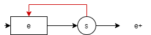
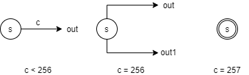
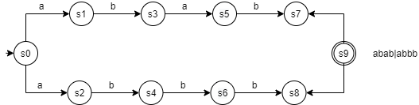
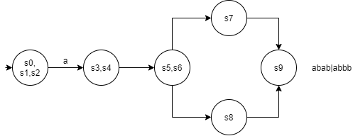

# 正则表达式解析器编写

## 引言

我在[正则表达式基础使用](https://juejin.cn/post/7005171891165986852)一文中介绍了正则表达式的基本使用，编写这篇文章的过程中，我的头脑中冒出了一个问题，正则表达式到底是如何匹配给定字符串的？当然，仅仅把其匹配机制当作是一种“魔法”时完全不行的。在进行一番搜索和文献阅读之后，我有了一些思路，如果你也曾思考过类似的问题，希望本篇文章能够给你带来一些启发。

本文首先对正则表达式（Regular Expressions）、有限自动机（finite automata）、非确定性有限状态自动机（NFA）、确定性有限状态自动机（DFA）、汤普森构造法（Thompson's construction）、汤普森（Thompson）提出的正则表达式搜索算法进行介绍，并且基于该算法，实现了一个正则表达式解析器，本人使用 Python 作为实现语言（因为 Python 足够简单易懂），但算法背后的思想却是适用于任何语言的。

## 正则表达式（Regular Expressions）

正则表达式用于描述字符串的集合，在普通搜索功能的基础上，提供了基于模式/规则的匹配。

1. 除了字符 **\*?+()|** 外，所有字符对自身进行匹配，对于特殊字符，需要使用转义字符 \ 进行转义
2. 如果 e1 匹配 a，e2 匹配 b，那么 **e1e2** 匹配 ab，**e1|e2** 匹配 a 或 b
3. 字符 **\*?+** 为数量修饰符，**e\*** 表示匹配 0 或多个 e，**e+** 表示匹配 1 或多个 e，**e?** 表示匹配 0 或 1 个 e
4. 运算符优先级为：**选择（e1|e2）< 组合（e1e2）< 数量修饰符（\*?+）**

以上为对正则表达式语法的简要介绍，除此之外，现代正则表达式还添加了许多特性，但为了简化我们的讨论，本文按下不表，事实上，为了使我们的注意力更集中于算法本身的思想而不是正则表达式的复杂实现上，本文后续也仅针对以上语法实现我们的正则表达式解析器（当然同时也是为了简化实现，可想而知，完整的实现十分复杂，而这篇文章本质是为了使读者了解正则表达式背后的实现原理，若不加限制，则背离了本人的初衷）。

## 有限自动机（Finite Automata）

有限自动机是描述字符串集合的另一种方式，有限自动机由一个有限的内部状态集和一组控制规则组成，其通过当前状态和下一个输入信号确定下一个状态。其中非确定性有限状态自动机（NFA）和确定性有限状态自动机（DFA）均是有限自动机的子集，后面我们还会发现，DFA 也是 NFA 的子集。

### 数学描述

DFA 可表示为五元组：

$$A = (I, S, f, Q, s_0)$$

其中：

1. $I$ 为所有输入字符，其是有限的
2. $S$ 为 NFA 的状态集，每一个元素被称为状态
3. $f$ 为转换函数，定义从 $S * I \rightarrow S$ 的单值映射，即 $f(p,a)=q$，即当前状态为 $p$ ，输入信号为 $a$ 时，将转换到下一个状态 $q$
4. $Q$ 为终止状态（接受状态），为 S 的子集
5. $s_0$ 为初始状态

NFA 与 DFA 的数学定义几乎一致，二者差别在于转换函数$f$，NFA 的转换函数为 $S*I \rightarrow p(S)\$ 的映射，其中 $p(S)$ 为 $S$ 的幂集（即 $S$ 的所有子集组成的集合），即 $f(p,a)=\{q_1,q_2,...q_k\}$ ，若当前状态为 $p$ ，输入信号为 $a$ 时，转换到的状态是一个状态集合。

简单地说，NFA 和 DFA 的区别就在于输入字符后，NFA 转换后状态可能是不唯一的，需要进一步选择，而 DFA 是唯一的，下例也将说明这一点。

### 例子

对于正则表达式 **a(bb)+a**，使用有限自动机可表示为：

+a-dfa.png>)

注意，此时 $s_0$ 表示起始状态， $s_4$ 表示终止状态，终止状态使用圆环表示，其余状态使用圆形表示。

此时对于自动机的每一个状态，仅有唯一一个状态进行对应，因此该自动机为 DFA，是**确定性的**。

在 DFA 匹配输入字符串时，每次读取一个字符，按照箭头使自动机从一个状态变换至另一个状态，假设输入字符串为 **abbbba**，开始状态为 $s_0$ ，读取字符 a 后，状态变为 $s_1$ ，读取 b 变为 $s_2$ ，读取 b 变为 $s_3$ ，读取 b 变为 $s_2$ ,读取 b 变为 $s_3$ ，读取 a 变为 $s_4$ ，由于 $s_4$ 为终止状态，因此该正则表达式成功匹配该字符串，读取流程如图所示：
+a-process.png>)

使用自动机匹配输入字符串时，有三种情况：

1. 完全读取字符串后，自动机停止于终止状态，此时匹配成功；
2. 完全读取字符串后，自动机停止于非终止状态，此时匹配失败；
3. 读取字符串过程中，自动机无指向下一状态的指针，但仍有字符未读取，此时匹配失败。

我们还可以将该 DFA 转化为 NFA：

+a-nfa.png>)

在状态 $s_3$ 处，自动机有两种选择：回到 $s_1$ 或继续到 $s_4$ ，此时状态 $s_3$ 对应状态集 $\{s_1, s_4\}$ ，因此该自动机为**非确定性**的。

## 汤普森构造法（Thompson's construction）

既然正则表达式和有限自动机都能够表示字符串的集合，二者之间就应该可以相互转化，事实上，也确实很多将正则表达式转化为有限自动机的算法，接下来我将介绍其中的一种——汤普森构造法，该方法能够将正则表达式转化为相应的非确定性有限状态自动机（事实上，正则表达式也可以转化为相应的确定性有限状态自动机）。

正则表达式的 NFA 表示是由对部分正则表达式的 NFA 构造组合而来的，不同的是，部分正则表达式对应的 NFA 没有终止状态，事实上，其含有一个或多个还未指向任何状态的指针，在构造过程中，根据出现的运算符，系统会按照运算符对应的逻辑将部分正则表达式对应的 NFA 中的未连接的指针相互连接，构造结束后，则会将所有仍未连接状态的指针连接至终止状态，从而得到正则表达式对应的 NFA 模型。

对于上文所述的正则表达式的语法，相应的 NFA 表示如下所示。

a. 单字符 a 表示为：



b. 正则表达式的连接 **e1e2** 表示为：



c. 正则表达式的选择 **e1|e2** 表示为：



注意，在表示 **e1|e2** 时，需要新建一个状态 s，这是因为按照 NFA 的定义，所有 NFA 必须有一个初始状态。

d. 正则表达式的数量修饰符 **?** 表示为：



e. 正则表达式的数量修饰符 **\*** 表示为：



f. 正则表达式的数量修饰符 **+** 表示为：



通过观察上述表示可看出 NFA 的最大状态数为正则表达式的长度。

## 正则表达式搜索算法（Multi-State Simulation）

使用正则表达式搜索输入字符串时，我们首先会将正则表达式转化为对应的 NFA，然后使用该 NFA 匹配输入的字符串，在匹配过程中，我们有两种策略。

由于 NFA 是非确定性的，即可能遇到分支情况，这种情况下，系统需要决定前往哪个分支，一种比较容易想到的方法是回溯法，使用回溯法的基本思想是首先前往第一个分支，如果结果错误，则返回尝试另一个分支。在最差情况下，每一步均可能出现两个分支，因此回溯法的时间复杂度为 $O(n->2^n)$ ，其中 $n$ 为 NFA 中的状态数，随着正则表达式复杂程度的提高，毫无疑问匹配速度会大幅度下降。

另一种比较高效的策略是同时对多个分支进行测试，并记录满足要求的状态存储至列表，对输入字符串遍历完成后，遍历列表内的所有状态，若存在终止状态，即认为该 NFA 匹配该输入字符串，该策略由 Thompson 于 1968 年提出，采取这种多状态模拟策略，在匹配的每一步最多遍历 NFA 中的每一个状态，因此时间复杂度为 $O(n->n)$ ，相比于回溯算法，这种算法大大提高了时间效率，这也是本文要实现的算法。

## 实现

下面我将基于 Python 实现上述多状态模拟策略，完整的源代码见[Python Regular Expressions Implementation](https://github.com/Civitasv/PYTHON_STUDYING/tree/master/Regular%20Expressions/interpreter)，文章的该部分在很大程度上借鉴了文章[Regular Expression Matching Can Be Simple And Fast (but is slow in Java, Perl, PHP, Python, Ruby, ...)](https://swtch.com/~rsc/regexp/regexp1.html)的实现思路。

### 1. 将正则表达式转化为 NFA

依据上文的汤普森构造法，将 NFA 中的状态抽象为：

```py
class State(object):
    def __init__(self, id, c) -> None:
        '''
        id: 表示 state 唯一 id
        c: state 表示的字符，c<256时，表示待匹配的字符，c=256时，表示 SPLIT 状态，c=257时，表示 MATCH 状态
        out: state 连接的下一个状态
        out1: 仅在 c 为 SPLIT状态 时使用，此时 out 和 out1 用于连接两种不同的选择（状态）
        lastlist: 用于标识 state 所处的 state 列表，在运行时用于防止重复添加
        State 事实上就是 NFA(片段)，就像树节点就是树，只不过 c<=256 时，out/out1 并不连接 MATCH 状态，而是存在一或多条无连接的出口，指向None
        '''
        self.id = id
        self.c = c
        self.out = None
        self.out1 = None
        self.lastlist = 0
```

根据 `State` 中的字符 `c`，可将 `State` 分为以下三种类型：



根据 Thompson 的论文，在将正则表达式转化为 NFA 之前，需要先将正则表达式转化为后缀表达式，并且使用运算符 **.** 表示连接运算符（即 e1e2 => e1e2.），类 **RexExp** 下的方法 **re2post** 完成了这一步骤，如正则表达式 **a(b|c)d** 的后缀表达式即为：**abc|.d.**。

解析该后缀表达式时，我们将维护部分正则表达式对应的 NFA 片段列表，其中每个片段表示为：

```py
class Frag(object):
    def __init__(self, start, out=None) -> None:
        '''
        start: 表示 NFA 片段中的开始状态
        out: 表示 NFA 片段中的所有仍未连接的 state，由于python为按值传递，因此，传递元组(out, outtype)，使用out.outtype进行连接
        (s, 'out')表示s.out
        (s, 'out1')表示s.out1
        在 NFA 生成的最后，应使这些未连接的连接至 MATCH state
        Frag 类用于简化 NFA 的生成，通过缓存 NFA 片段的所有 out，而不是每次遍历 state 列表获取未连接的 state，可以大大加快运行速度
        '''
        # start state
        self.start = start
        # * list of out state item: (out, outtype)
        # * eg: (s, 'out') -> s.out
        # * (s, 'out1') -> s.out1
        self.out = out
```

在汤普森构造法一节中已经说明，部分正则表达式对应的 NFA 没有终止状态，事实上，其含有一个或多个还未指向任何状态的指针，因此，此处的 **start** 即为 NFA 片段的开始状态，**out** 即为所有仍未连接状态的指针，可能为 **s.out** 或 **s.out1**，在构造过程中，系统会自动判断运算符的逻辑或处于终止状态以使 NFA 片段的 所有 **out** 指针正确指向相应的值。

一些 helper 函数：

```py
def singletonlist(self, item):
    '''
    item: (state, outtype)
    其中outtype可取 'out'和'out1'
    分别表示状态state的out指针和out1指针
    '''
    return [item]

def patch(self, out, state):
    '''
    out: NFA 片段的所有未连接的指针
    state: 某状态 s
    该函数用于将 该片段的所有出口与 state 连接
    '''
    for item, out_type in out:
        if out_type == 'out':
            item.out = state
        else:
            item.out1 = state

def append(self, out1, out2):
    '''
    out1: NFA 片段1所有未连接的指针
    out2: NFA 片段2所有未连接的指针
    该函数用于将片段1的未连接的指针和片段2的未连接的指针合并
    '''
    return out1+out2

```

其中 **singletonlist** 用于生成一个仅含有 **item** 的指针列表，**patch** 用于将 NFA 片段的所有未连接的指针列表 **out** 连接至状态 **state**，**append** 用于将两个 NFA 片段的未连接指针进行合并。

有了以上定义，我们只需要按照汤普森构造法的步骤即可准确构造 NFA，函数 **post2nfa** 实现了该方法。

a. 对于连接运算符 **.**：


```py
if item == '.':  # ! catenate，本解析器将.作为显式连接符
    e2 = frags.pop()
    e1 = frags.pop()
    self.patch(e1.out, e2.start)
    frags.append(RegExp.Frag(e1.start, e2.out))
```

b. 对于选择运算符 **|**：


```py
e2 = frags.pop()
e1 = frags.pop()
s = RegExp.State(self.get_state_num(), RegExp.SPLIT)
s.out = e1.start
s.out1 = e2.start
frags.append(RegExp.Frag(s, self.append(e1.out, e2.out)))
```

c. 对于数量修饰符 **?**：


```py
e = frags.pop()
s = RegExp.State(self.get_state_num(), RegExp.SPLIT)
s.out = e.start
frags.append(RegExp.Frag(
    s, self.append(e.out, self.singletonlist((s, 'out1')))))
```

d. 对于数量修饰符 **\***：


```py
e = frags.pop()
s = RegExp.State(self.get_state_num(), RegExp.SPLIT)
s.out = e.start
self.patch(e.out, s)
frags.append(RegExp.Frag(s, self.singletonlist((s, 'out1'))))
```

e. 对于数量修饰符 **+**：


```py
e = frags.pop()
s = RegExp.State(self.get_state_num(), RegExp.SPLIT)
s.out = e.start
self.patch(e.out, s)
frags.append(RegExp.Frag(
    e.start, self.singletonlist((s, 'out1'))))
```

f. 对于单字符：


```py
s = RegExp.State(self.get_state_num(), item)
frags.append(RegExp.Frag(s, self.singletonlist((s, 'out'))))
```

按照这些步骤对后缀表达式解析完成后，会将所有仍未连接状态的指针连接至终止状态（MATCH），从而得到正则表达式对应的 NFA 模型。

### 2. 使用正则表达式搜索算法匹配输入字符串

使用 NFA 匹配输入字符串时，我们构造两个列表：当前成功匹配状态列表 **cstates**、读取下一字符后的成功匹配状态列表 **nstates**。其中 **cstates** 初始化为输入的 NFA。

```py
def match(self, start, input_str):
    '''
    start: NFA
    input_str: 待匹配字符串
    该函数使用构建成功的 NFA 匹配输入的字符串，若成功匹配则返回True
    '''
    cstates = []  # ! current states
    nstates = []  # ! next states

    # 根据 NFA 构建初始状态集
    cstates = self.start_states(cstates, start)

    for c in input_str:
        self.step(cstates, c, nstates)
        cstates = nstates
        nstates = []

    return self.is_match(cstates)

```

随着读取输入字符串的每一个字符，系统执行 **step** 方法，该方法对 **cstates** 进行循环读取，以获得 **cstates** 中所有可以匹配当前字符的状态列表，并将每个状态的 **out 指针指向的 state** 加入 **nstates**中，执行完成 **step** 函数之后，将 **cstates** 赋值为 **nstates**，并将 **nstates** 置空。

```py
def step(self, cstates, c, nstates):
    '''
    cstates: 目前所有成功匹配的 NFA 片段
    c: 待匹配的字符
    nstates: 下一状态列表，用于存储所有成功匹配 c 的 NFA 片段
    该函数用于在目前所有成功匹配的 NFA 片段中匹配字符 c，若成功匹配，
    则将该 NFA 片段的下一状态加入 nstates 列表，用于匹配下一字符
    '''
    self.list_id += 1
    for state in cstates:
        if state.c == c:
            self.add_state(nstates, state.out)
```

方法 **add_state** 用于将某 state 加入 states 列表中，需要注意不能重复添加，这也是 **State** 类中的 lastlist 属性的作用，每次执行 step 函数，系统新建状态列表，同时使得 **listid** 自增 1，这样，通过判断某 state 的 lastlist 属性，即可判断该 state 是否已加入 states 列表，同时，按照上述陈述的正则表达式搜索算法，我们需要判断 state 是否为分支状态，若为分支状态，则认为应对其两个分支状态分别执行 **add_state** 方法。

```py
def add_state(self, states, state):
    '''
    states: NFA 片段列表
    state: 待添加的 state/nfa
    该函数用于将 state 添加至 states，注意
    1. 空状态/已存在的状态不能重复添加
    2. SPLIT 状态时，应添加其两个分支状态
    '''
    # state 为空 或 state 已经在 states 中，不重复添加
    if state is None or state.lastlist == self.list_id:
        return

    state.lastlist = self.list_id
    if state.c == RegExp.SPLIT:
        # 添加两个分支状态
        self.add_state(states, state.out)
        self.add_state(states, state.out1)
        return
    states.append(state)
```

最后，**is_match** 方法用于判断遍历完毕输入字符串后，最后匹配的状态列表中是否存在终止状态，若存在，则认为成功匹配，反之失败。

```py
def is_match(self, states):
    '''
    states: 遍历输入字符串之后所有成功匹配的 NFA 片段
    该函数用于检验遍历完毕后，剩余合法的 NFA 片段中是否处于MATCH状态，
    若某 NFA 片段处于 MATCH 状态，则成功匹配
    '''
    for state in states:
        if state.c == RegExp.MATCH:
            return True

    return False
```

## 将 NFA 转化为 DFA

确定性有限状态自动机（DFA）也可以唯一表示某正则表达式，由于 DFA 不存在分支情况，因此在效率上也常常优于 NFA。

事实上，任意 NFA 均可以转化为相应的 DFA 表示，其中 DFA 的每个状态表示为 NFA 的状态列表。

例如，对于正则表达式 **abab|abbb**，其 NFA 表示为：



转化为对应的 DFA，则表示为：



在某种意义上，上文阐述的搜索算法相当于在执行 DFA，其中 cstates 相当于 DFA 中的一个状态，每执行一次 step 函数，则获得一个新的满足条件的 DFA 状态。

Thompson 关于模拟 DFA 的基本思想是：在执行 step 函数时，获得 nstates 之后，将其使用某种数据结构缓存起来，这样既可以按需计算，也可以避免重复计算，下面我将依据该思想基于上文所述的 NFA 实现使用 DFA 模型编写正则表达式的搜索算法。

首先引入一种新的数据类型 **DState**，其用于表示 DFA 状态：

```py
class DState(object):
    def __init__(self, states) -> None:
        '''
        states: DFA 中的一个状态相当于 NFA 中的状态（片段）集
        next: 保存所有指向下一状态的指针，大小为256（扩展后的ascii码），
        若当前状态为 d，输入字符为 c，那么 d.next[c] 即为下一状态，若 d.next[c] 为 None，说明还未连接
        left: 树左分支
        right: 树右分支
        '''
        self.states = states
        self.next = [None for _ in range(256)]
        self.right = None
        self.left = None
```

**DState** 用于缓存 NFA 搜索算法中的 cstates，其中的 **next** 列表存储指向所有可能状态的指针：本正则表达式解析器仅针对扩展后的 ascii 码进行匹配，因此 next 列表的长度为 256，若当前状态为 d，输入字符为 c，那么 d.next\[c]即为输入字符 c 后的下一状态，如果 d.next\[c]为 None，则说明下一状态还未计算，需要调用 **next_state** 方法进行计算，然后缓存至 d.next\[c]，**left** 和 **right** 指针用于构造二叉搜索树。

使用 DFA 匹配输入字符串时，系统将遍历输入字符串中的字符，判断当前状态 d.next\[c]是否为 None，若为 None，则调用 **next_state** 方法生成 DFA 的状态，**match** 方法实现如下：

```py
def match(self, start, input_str):
    '''
    start: DFA
    input_str: 输入字符串
    该函数用于使用 DFA 匹配输入的字符串
    '''
    for c in input_str:
        index = ord(c)
        if start.next[index]:
            next_state = start.next[index]
        else:
            next_state = self.next_dstate(start, c)
        start = next_state
    return self.is_match(start.states)
```

系统以 NFA 中的排序的状态列表为 key，构造二叉搜索树，通过传递 NFA 状态列表，获取对应的 DState。

```py
def get_dstate(self, states):
    '''
    states: 状态集
    该函数以状态集作为 key，获取该状态集对应的 DState
    '''
    # 排序
    states.sort(key=lambda state: id(state))

    # 循环目前的 dstate
    dstate = self.dstate
    while dstate:
        cmp = self.states_cmp(states, dstate.states)
        if cmp < 0:
            dstate = dstate.left
        elif cmp > 0:
            dstate = dstate.right
        else:
            return dstate

    # 新建dstate
    dstate = RegExp.DState(states)
    return dstate
```

**next_state** 方法获取当前 DState 和输入字符，通过执行 step 函数获得下一状态列表，然后通过 **get_state** 方法获取对应的 DState，然后缓存至 d.next\[c]中。

```py
def next_dstate(self, dstate, c):
    '''
    dstate: DFA 片段
    c: 输入字符
    该函数根据当前 DFA 和输入字符获取 DFA 的下个状态（也即 NFA 的状态集）
    '''
    nstates = []
    self.step(dstate.states, c, nstates)
    dstate.next[ord(c)] = self.get_dstate(nstates)
    return dstate.next[ord(c)]
```

**start_dstate** 方法以 NFA 为参数，初始化 DState。

```py
def start_dstate(self, start):
    '''
    start: state(也就是NFA)
    该函数根据 NFA 获取初始 DFA
    '''
    states = []
    return self.get_dstate(self.start_states(states, start))
```

注意，该 DFA 中的状态是对 step 函数结果的缓存，因此，在实际使用时，往往会加入内存管理，以防止内存溢出，但限于篇幅，本文暂不介绍。

## 参考文献

1. [Regular Expression Matching Can Be Simple And Fast(but is slow in Java, Perl, PHP, Python, Ruby, ...)](https://swtch.com/~rsc/regexp/regexp1.html)
2. [Writing own regular expression parser](https://www.codeproject.com/Articles/5412/Writing-own-regular-expression-parser#Seven)
3. [Regular Expression Search Algorithm](https://dl.acm.org/doi/pdf/10.1145/363347.363387)
